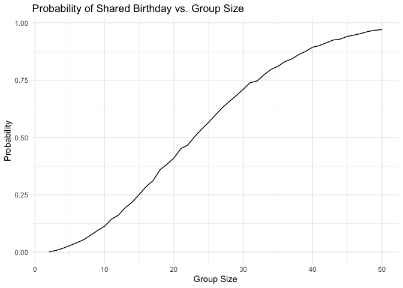
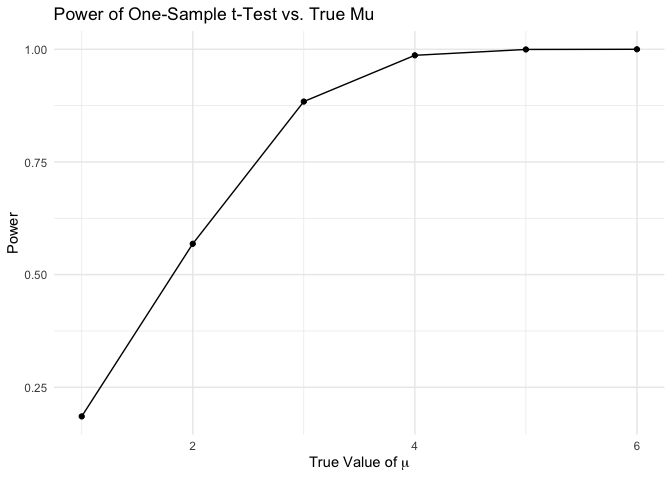
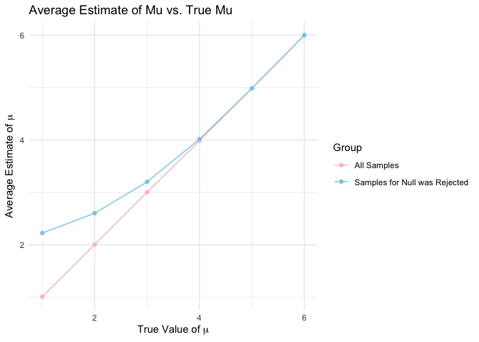
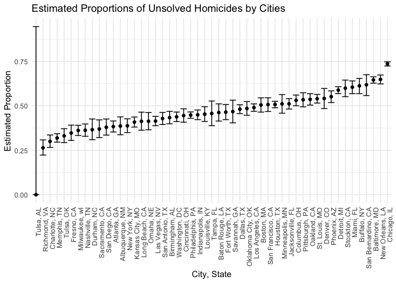

p8105_hw5_dl3757
================
Dang Lin dl3757
2024-11-15

``` r
library(tidyverse)

set.seed(3757)
```

# Problem 1

``` r
# Write a function to check if there are duplicate birthdays in a group
birthday_sim = function(n) {

  bdays = sample(1:365, size = n, replace = TRUE)
  
  duplicate = length(unique(bdays)) < n

  return(duplicate)
  
}

# Check whether there are duplicate birthdays in a group of 10 people
knitr::kable(birthday_sim(10), col.name = "Return Result", 
             caption = "Group Size of 10")
```

| Return Result |
|:--------------|
| FALSE         |

Group Size of 10

``` r
# Run the function 10000 times for each group size between 2 and 50
sim_res = 
  expand_grid(
    n = 2:50,
    iter = 1:10000
  ) %>% 
  mutate(res = map_lgl(n, birthday_sim)) %>%
  group_by(n) %>% 
  summarize(prob = mean(res))

# Make a plot showing the probability as a function of group size
sim_res %>%
  ggplot(aes(x = n, y = prob )) + 
  geom_line() + 
  labs(
    title = "Probability of Shared Birthday vs. Group Size", 
    x = "Group Size",
    y = "Probability") +
  theme_minimal()
```

<!-- -->

From the plot, it can be observed that the probability of at least two
people sharing a birthday increases as the group size grows. When the
group size is small, the probability increases gradually. However, as
the group size becomes larger, the probability rises more rapidly.
Eventually, the probability approaches 1 as the group size becomes
sufficiently large.

# Problem 2

## (a)

``` r
# Set parameters
n <- 30
sigma <- 5 
mu <- 0
alpha <- 0.05
iterations <- 5000

# Write a function that return t test results
simulate_t_test <- function(n, mu, sigma) {
  simulate_data <- rnorm(n, mean = mu, sd = sigma)
  
  t_test_results <- t.test(simulate_data, mu = 0) %>% 
    broom::tidy() %>% 
    select(estimate = estimate, 
           p.value = p.value)
  
  return(t_test_results)
}

# Generate 5000 datasets from the model
simulate_results_df_1 <- 
  expand_grid(
  true_mu = mu,
  iter = 1:iterations) %>%
  mutate(
    result = map(true_mu, ~ simulate_t_test(n, .x, sigma))
  ) %>%
  unnest(result)

# Create a table with head 10 simulations
knitr::kable(head(simulate_results_df_1, 10), 
             col.names = c("True Mu", "Iterations", 
                           "Estimate", "P-value"))
```

| True Mu | Iterations |   Estimate |   P-value |
|--------:|-----------:|-----------:|----------:|
|       0 |          1 |  1.5358449 | 0.1159123 |
|       0 |          2 |  0.5374540 | 0.5386749 |
|       0 |          3 |  1.0308550 | 0.2075413 |
|       0 |          4 |  0.0787270 | 0.9385383 |
|       0 |          5 | -0.0984129 | 0.9248207 |
|       0 |          6 |  0.0608515 | 0.9544204 |
|       0 |          7 |  3.0642782 | 0.0011421 |
|       0 |          8 | -1.2206067 | 0.1787621 |
|       0 |          9 | -0.7331486 | 0.4606680 |
|       0 |         10 | -1.0955187 | 0.2137149 |

## (b)

``` r
# Run simulations for different mu values
simulate_results_df_2 <- 
  expand_grid(
  true_mu = c(1, 2, 3, 4, 5, 6),
  iter = 1:iterations) %>%
  mutate(
    result = map(true_mu, ~ simulate_t_test(n, .x, sigma))
  ) %>%
  unnest(result)

# Calculate power for each mu value
power_results <- simulate_results_df_2 %>%
  group_by(true_mu) %>%
  summarize(power = mean(p.value < alpha))

# Make a plot showing the proportion of times the null was rejected
ggplot(power_results, aes(x = true_mu, y = power)) +
  geom_line() +
  geom_point() + 
  labs(title = "Power of One-Sample t-Test vs. True Mu",
       x = expression("True Value of " * mu),
       y = "Power") +
  theme_minimal()
```

<!-- -->

The power increases as the effect size grows, indicating that a larger
effect size makes it easier for the t-test to distinguish the true mean
from the null hypothesis.

## (c)

``` r
# Make a plot of Average Estimate of Mu vs. True Mu by comparing different samples
simulate_results_df_2 %>%
  group_by(true_mu) %>%
  summarize(
    average_mu = mean(estimate),
    average_mu_rejected = mean(estimate[p.value < alpha])
  ) %>% 
  ggplot(aes(x = true_mu)) + 
  geom_line(aes(y = average_mu, color = "All Samples")) + 
  geom_point(aes(y = average_mu, color = "All Samples")) + 
  geom_line(aes(y = average_mu_rejected, color = "Samples for Null was Rejected")) + 
  geom_point(aes(y = average_mu_rejected, color = "Samples for Null was Rejected")) + 
  scale_color_manual(
    name = "Group",  
    values = c("All Samples" = "pink", "Samples for Null was Rejected" = "skyblue"),  
  ) +
  labs(
    title = "Average Estimate of Mu vs. True Mu",
    x = expression("True Value of " * mu),
    y = expression("Average Estimate of " * mu)
  ) +
  theme_minimal()
```

<!-- -->

By comparing the two lines in the plot above, it is clear that the
sample average of estimated $\mu$ across tests where the null hypothesis
was rejected is not approximately equal to the true value of $\mu$. The
line representing the sample average of estimated $\mu$ for tests where
the null hypothesis was rejected is slightly higher than the average
estimate of $\mu$ for the samples when the true value of $\mu$ is 1, 2,
3, and 4. This occurs because the samples where the null hypothesis was
rejected tend to have higher estimates of $\mu$. In these cases, the 95%
confidence intervals of these samples generally do not include 0,
pulling their average estimate of $\mu$ farther from 0. Consequently,
the samples that reject the null hypothesis have a higher average
estimate of $\mu$.

# Problem 3

## (a)

``` r
# Read and clean the dataset
homicide_data <- read_csv("homicide-data.csv", 
                          na = c("NA", ".", "")) %>% 
  janitor::clean_names() %>% 
  mutate(city_state = str_c(city, state, sep = ", ")) %>% 
  mutate(unsolved_homicides = disposition %in% 
           c("Closed without arrest", "Open/No arrest"))

# Summarize within cities to obtain the total number of homicides 
# and the number of unsolved homicides
homicide_summary <- homicide_data %>% 
  group_by(city_state) %>% 
  summarize(total_homicides = n(), 
          unsolved_homicides = sum(unsolved_homicides, na.rm = TRUE))

knitr::kable(head(homicide_summary, 10), 
             col.names = c("City, State", "Total Homicides", "Unsolved Homicides"))
```

| City, State     | Total Homicides | Unsolved Homicides |
|:----------------|----------------:|-------------------:|
| Albuquerque, NM |             378 |                146 |
| Atlanta, GA     |             973 |                373 |
| Baltimore, MD   |            2827 |               1825 |
| Baton Rouge, LA |             424 |                196 |
| Birmingham, AL  |             800 |                347 |
| Boston, MA      |             614 |                310 |
| Buffalo, NY     |             521 |                319 |
| Charlotte, NC   |             687 |                206 |
| Chicago, IL     |            5535 |               4073 |
| Cincinnati, OH  |             694 |                309 |

The raw data consists of 52,179 observations and 12 variables. The
dataset provides detailed information about homicide incidents across
various cities and states in the United States, including the victims’
personal details, geographic information, and case outcomes. The
variables include attributes such as `reported_date`, `victim_first`,
`city`, `state`, and `disposition`.

## (b)

``` r
# Clean the dataset
baltimore <- homicide_data %>%
  filter(city_state == "Baltimore, MD")

# Calculate total homicides and unsolved homicides in Baltimore
total_homicides <- nrow(baltimore)
unsolved_homicides <- baltimore %>% 
  pull(unsolved_homicides) %>% 
  sum(na.rm = TRUE)

# Perform the proportion test and use broom::tidy to clean the output
prop_test_baltimore <- prop.test(x = unsolved_homicides, n = total_homicides) %>% 
  broom::tidy()

knitr::kable(prop_test_baltimore, digits = 3)
```

| estimate | statistic | p.value | parameter | conf.low | conf.high | method                                               | alternative |
|---------:|----------:|--------:|----------:|---------:|----------:|:-----------------------------------------------------|:------------|
|    0.646 |   239.011 |       0 |         1 |    0.628 |     0.663 | 1-sample proportions test with continuity correction | two.sided   |

## (c)

``` r
# Perform the proportion test for each city
city_proportions <- homicide_summary %>%
  mutate(
    prop_test_result = map2(unsolved_homicides, total_homicides, ~ prop.test(.x, .y)),
    tidy_result = map(prop_test_result, broom::tidy) 
  ) %>%
  unnest(tidy_result) %>%
  select(city_state, estimate, conf.low, conf.high)
```

## (d)

``` r
# Create a plot that shows the estimates and CIs for each city
city_proportions %>%
  mutate(city_state = fct_reorder(city_state, estimate)) |> 
  ggplot(aes(x = city_state, y = estimate)) + 
  geom_point() + 
  geom_errorbar(aes(ymin = conf.low, ymax = conf.high)) + 
  labs(
    title = "Estimated Proportions of Unsolved Homicides by Cities",
    x = "City, State",
    y = "Estimated Proportion"
  ) +
  theme_minimal() +
  theme(axis.text.x = element_text(angle = 90, hjust = 1)) 
```

<!-- -->
